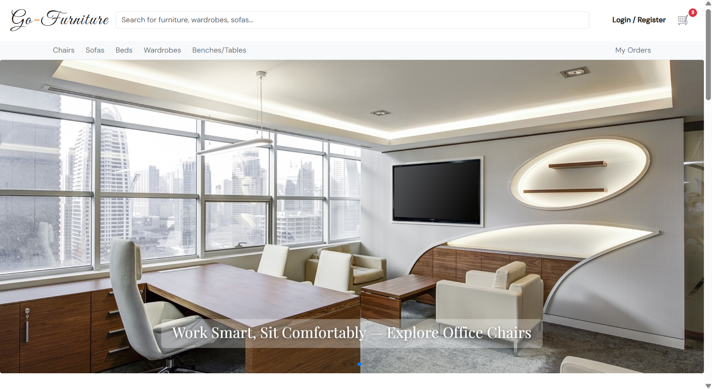
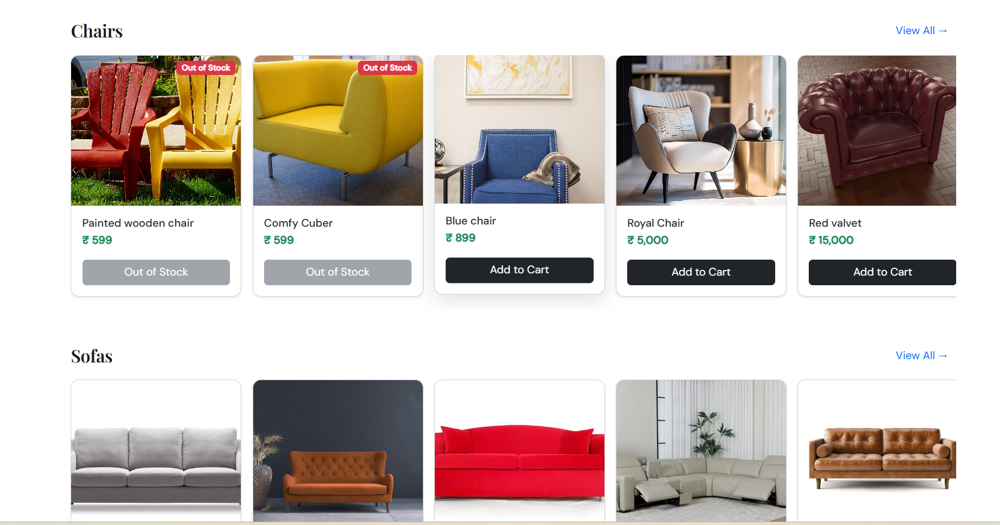
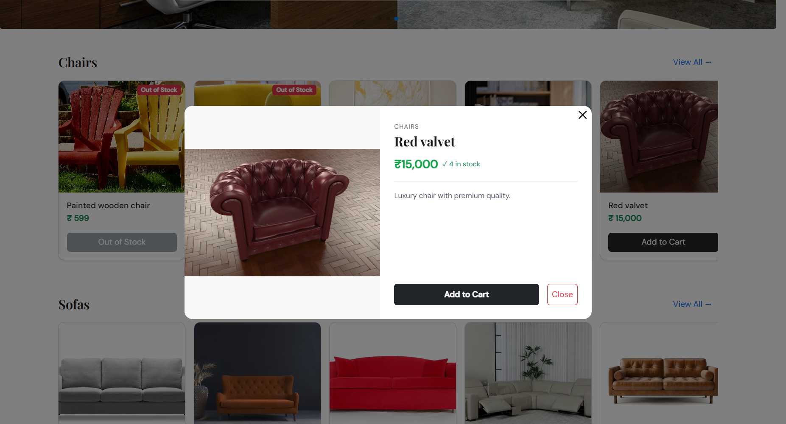
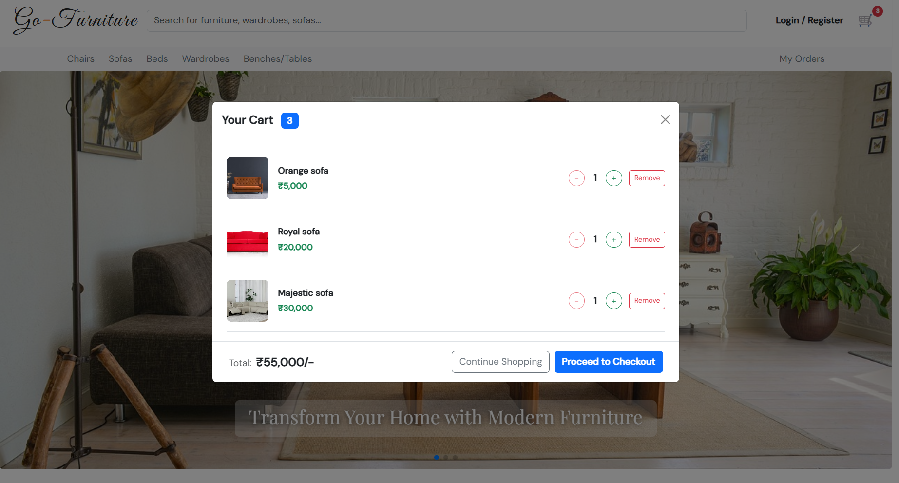
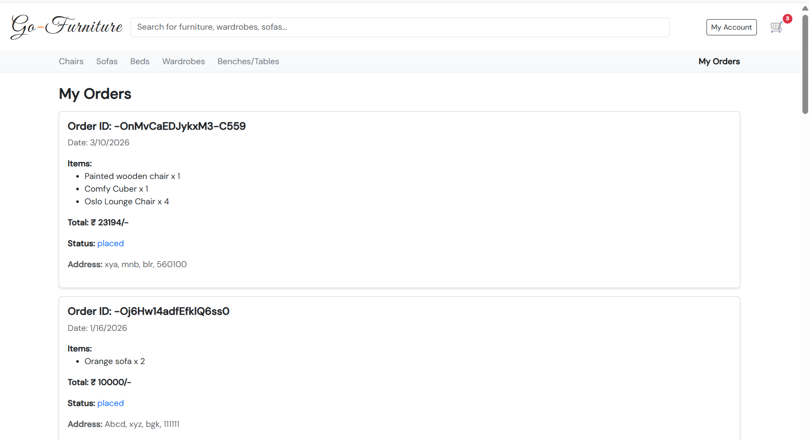
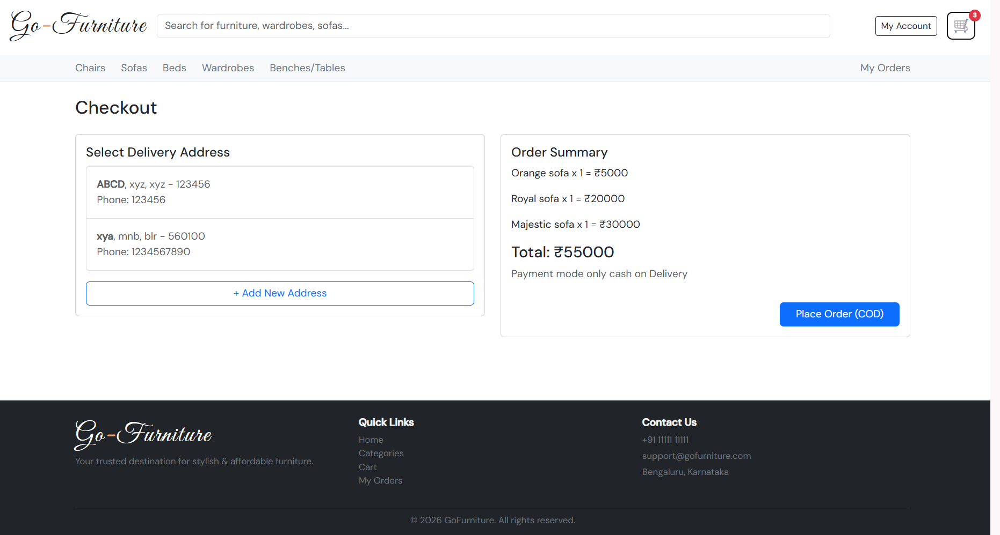
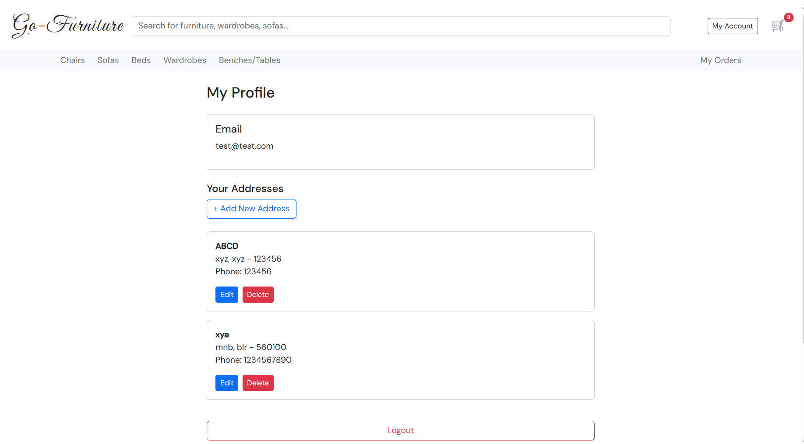

# 🛋️ Go-Furniture

A full-featured e-commerce web application for furniture shopping built with React and Firebase. Users can browse furniture by category, search products, manage a cart, place orders with address management, and track their order history — all with a responsive mobile-first layout.

**Live Demo:** [go-furniture-ecommerce.netlify.app](https://go-furniture-ecommerce.netlify.app)

---

## 📸 Screenshots
**Slider section homepage:**


**Homepage category**


**Product detail**


**My Cart**


**My Orders**


**Checkout page**


**My profile account**


---

## ✨ Features

- **Browse by Category** — Chairs, Sofas, Beds, Wardrobes, Benches/Tables
- **Debounced Search** — Auto-searches as you type with a 500ms debounce, no submit needed
- **Product Detail Modal** — Click any product card to view full details in a modal without leaving the page
- **Cart Modal** — View and manage cart items in a centered modal from anywhere on the site
- **Real-time Stock Validation** — Stock is re-checked from Firebase before placing an order to prevent overselling
- **Checkout with COD** — Cash on Delivery with address selection
- **Address Management** — Full CRUD (add, edit, delete) from the profile page
- **Order History** — View all past orders with status and delivery address
- **Authentication** — Email/password login and signup via Firebase Auth
- **Persistent Cart** — Cart state saved to localStorage, survives page refreshes
- **Protected Routes** — Orders and Profile pages gated behind login
- **Mobile Responsive** — Hamburger menu with slide-in sidebar drawer on mobile
- **Toast Notifications** — User feedback via react-toastify throughout the app
- **Elegant Typography** — Playfair Display serif font for section headings

---

## 🛠️ Tech Stack

| Layer | Technology |
|---|---|
| Frontend | React 18, Vite |
| Styling | React-Bootstrap, Bootstrap 5, Custom CSS |
| State Management | Redux Toolkit |
| Backend / Database | Firebase Realtime Database |
| Authentication | Firebase Authentication (REST API) |
| Routing | React Router DOM v6 |
| Carousels | Swiper.js |
| Notifications | React-Toastify |
| Fonts | Playfair Display, DM Sans (Google Fonts) |
| Deployment | Netlify |

---

## 📁 Project Structure

```
src/
├── components/
│   ├── home/
│   │   ├── HeroSlider.jsx          # Swiper hero banner with autoplay
│   │   ├── ProductCard.jsx         # Reusable card — opens ProductDetailModal on click
│   │   ├── ProductDetailModal.jsx  # Full product info in a centered modal
│   │   ├── ProductSection.jsx      # Category section with horizontal Swiper carousel
│   │   ├── CartModal.jsx           # Centered cart modal with quantity controls
│   │   ├── AddressForm.jsx         # Reusable address form (add/edit)
│   │   └── AddressSelector.jsx     # Select existing or add new address at checkout
│   └── layout/
│       ├── Header.jsx              # Logo, debounced search, cart button, hamburger
│       ├── Navbar.jsx              # Category navigation bar (hidden on mobile)
│       ├── MobileSidebar.jsx       # Slide-in drawer with categories and account links
│       ├── Footer.jsx              # Links, contact info, copyright
│       └── MainLayout.jsx          # Shared layout wrapper with Outlet
├── hooks/
│   └── useDebounce.js              # Custom hook for debounced search
├── pages/
│   ├── auth/
│   │   ├── LoginPage.jsx
│   │   ├── SignUpPage.jsx
│   │   └── ProtectedRoute.jsx
│   ├── HomePage.jsx
│   ├── CategoryPage.jsx
│   ├── ProductDetailsPage.jsx      # Standalone page for direct URL visits
│   ├── CartPage.jsx
│   ├── CheckoutPage.jsx
│   ├── OrdersPage.jsx
│   ├── ProfilePage.jsx
│   ├── SearchPage.jsx
│   └── ThankYouPage.jsx
├── reduxStore/
│   ├── store.js
│   ├── authSlice.js                # Login, logout, token + email persistence
│   └── cartSlice.js                # Cart CRUD with localStorage persistence
├── layout.css                      # Sidebar, modal, hamburger, font styles
└── index.css                       # Global base styles
```

---

## 🚀 Getting Started

### Prerequisites

- Node.js v18+
- A Firebase project with Realtime Database and Authentication enabled

### Installation

```bash
# Clone the repository
git clone https://github.com/AbhayPatil444/go-furniture-user.git
cd go-furniture-user

# Install dependencies
npm install
```

### Environment Variables

Create a `.env` file in the root of the project:

```env
VITE_USER_FIREBASE_BASE_URL=https://your-project-default-rtdb.firebaseio.com
VITE_USER_FIREBASE_AUTH_API_KEY=your_firebase_web_api_key
```

> ⚠️ Never commit your `.env` file. It is already listed in `.gitignore`.

### Run Locally

```bash
npm run dev
```

### Build for Production

```bash
npm run build
```

---

## 🔐 Firebase Setup

1. Go to [Firebase Console](https://console.firebase.google.com) and create a project
2. Enable **Realtime Database** and configure security rules
3. Enable **Email/Password** under Authentication → Sign-in methods
4. Copy your **Web API Key** from Project Settings → General
5. Copy your **Database URL** from Realtime Database → Data

### Recommended Database Rules

```json
{
  "rules": {
    "products": {
      ".read": true,
      ".write": false
    },
    "users": {
      "$uid": {
        ".read": "auth != null",
        ".write": "auth != null"
      }
    },
    "orders": {
      "$uid": {
        ".read": "auth != null",
        ".write": "auth != null"
      }
    }
  }
}
```

---

## 🧠 Key Implementation Highlights

**Debounced search** — The `useDebounce` custom hook fires the search 500ms after the user stops typing, avoiding a fetch on every keystroke without needing a submit button.

**Product detail modal** — Clicking a product card fetches that product's data from Firebase and renders it in a modal. The route `/product/:id` still works for direct URL access, so both flows coexist cleanly.

**Real-time stock validation at checkout** — Before placing an order, the app re-fetches live stock from Firebase for every cart item in parallel using `Promise.all`, validates quantities, and only then deducts stock and saves the order. This prevents overselling in concurrent sessions.

**Cart persistence** — Cart state lives in Redux and is mirrored to `localStorage` on every reducer action, so it survives page refreshes and browser restarts without a backend session.

**Mobile sidebar** — The hamburger drawer uses CSS `transform: translateX()` with a `cubic-bezier` transition. A backdrop overlay closes it on outside tap. `document.body.style.overflow` is locked while open to prevent background scrolling.

**Per-user data isolation** — Firebase Realtime Database doesn't allow `.` in key names. User emails are encoded by replacing `.` with `,` before being used as path segments, keeping each user's addresses and orders fully isolated.

---

## 📦 Dependencies

```json
{
  "react": "^18",
  "react-dom": "^18",
  "react-router-dom": "^6",
  "@reduxjs/toolkit": "latest",
  "react-redux": "latest",
  "react-bootstrap": "latest",
  "bootstrap": "^5",
  "swiper": "latest",
  "react-toastify": "latest"
}
```

---

## 🙋 Author

**Abhay Patil**
- GitHub: [@AbhayPatil444](https://github.com/AbhayPatil444)
- Live: [go-furniture-ecommerce.netlify.app](https://go-furniture-ecommerce.netlify.app)